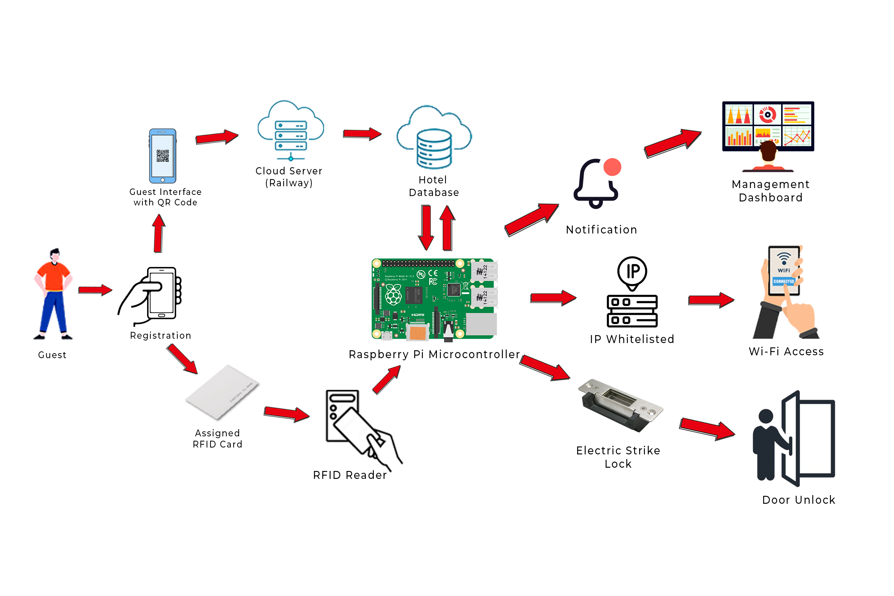
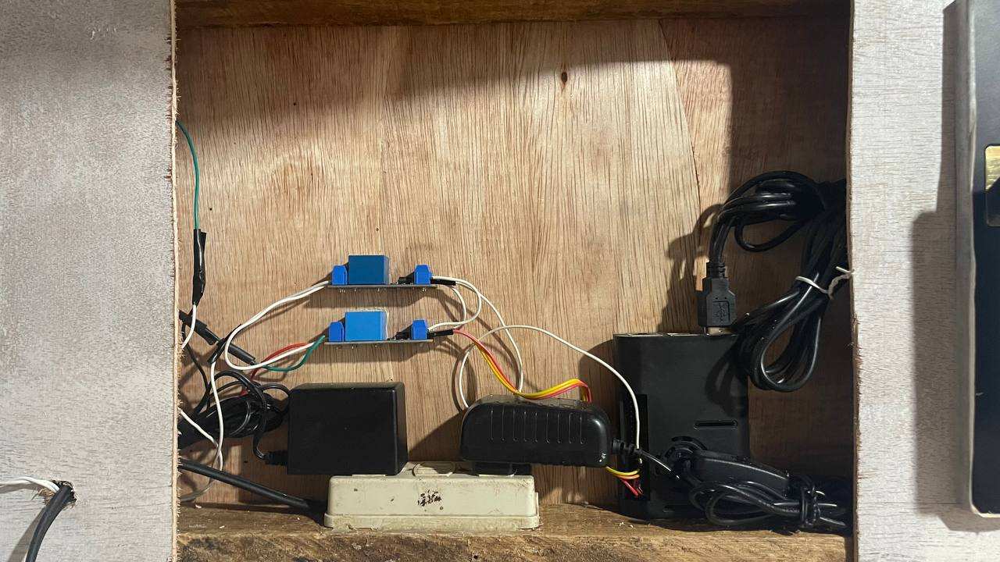
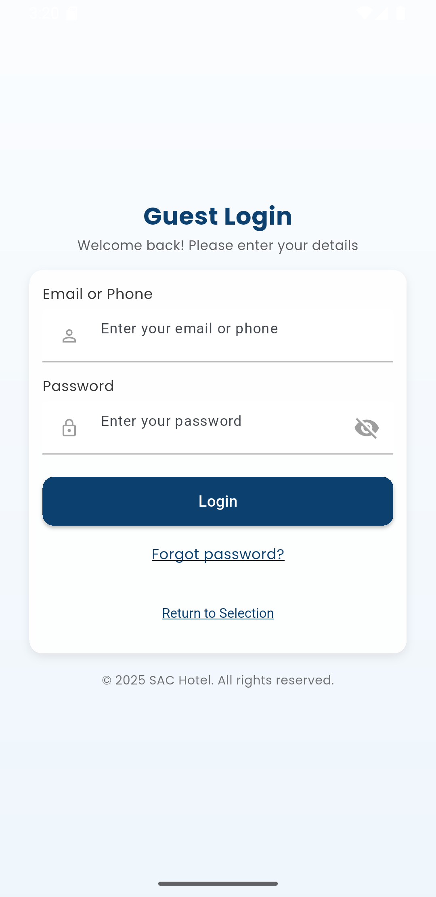
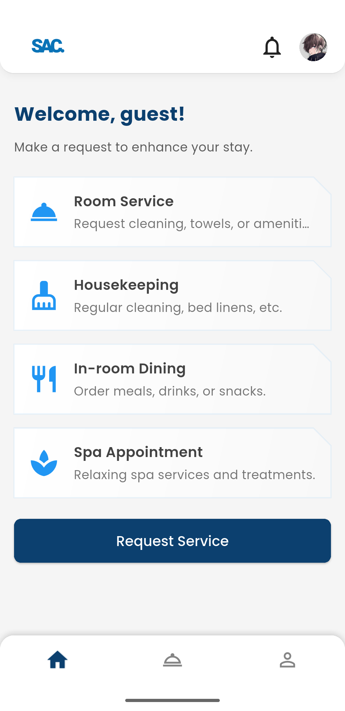
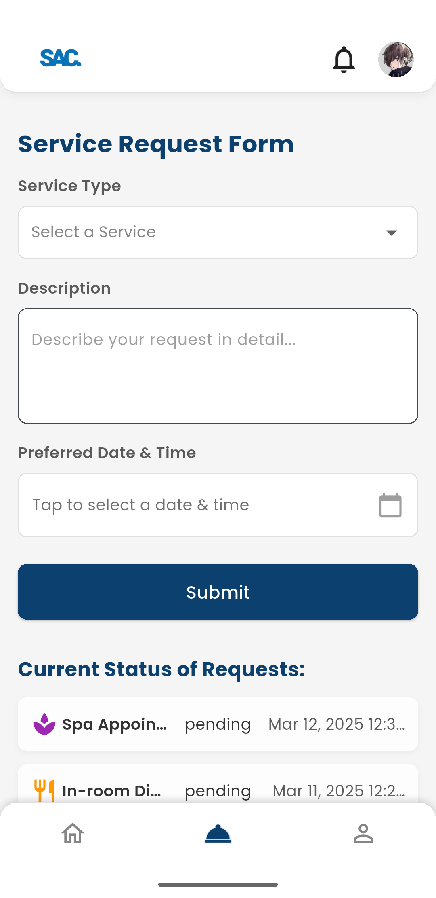
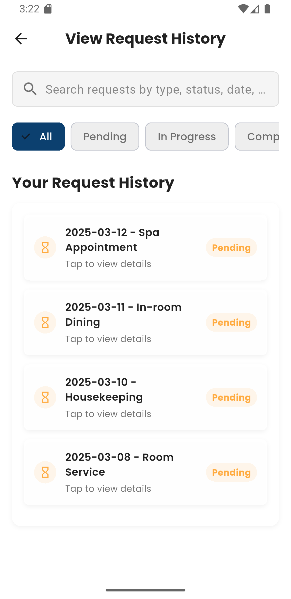
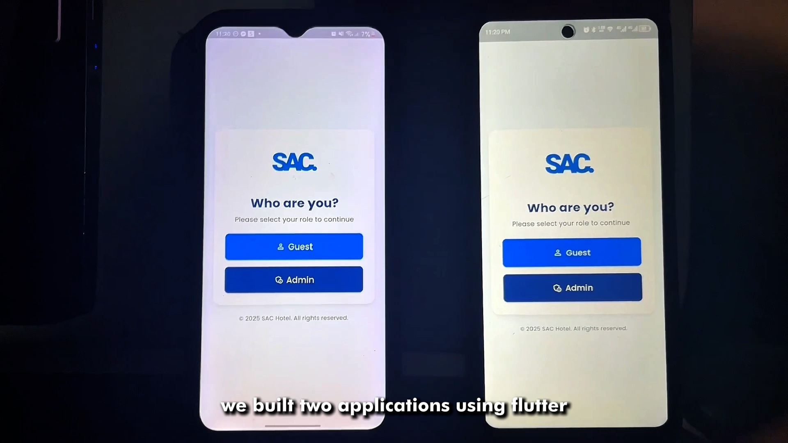

# IMPLEMENTATION OF SMART ACCESS CONTROL IN HOTEL ROOMS INTEGRATING RFID AND IOT

**A Thesis Project by Leah Mae P. Eyas, Samantha Shane M. Gabales, and Christian Jerald S. Jutba**
_Presented to the Faculty of College of Engineering, Jose Rizal Memorial State University - Main Campus (April 2024)_

---

## 📖 Abstract

[cite_start]The hospitality industry is increasingly shifting towards digital transformation to enhance guest experiences through seamless, secure, and contactless services[cite: 21]. [cite_start]This project addresses the critical gap in hotel systems characterized by fragmented solutions for room access, Wi-Fi connectivity, and guest service management[cite: 22]. [cite_start]We developed and implemented an Integrated Smart Access Control System that combines RFID-based room access, automated MAC-address-based Wi-Fi provisioning, and a real-time guest service request platform[cite: 23]. [cite_start]Utilizing a Raspberry Pi 4, the system offers a robust, scalable, and secure IoT-enabled solution that optimizes hotel operations and enhances guest satisfaction[cite: 24, 30, 31].

[cite_start]**Keywords:** Smart Access Control, RFID, Internet of Things (IoT), Raspberry Pi, Automated Wi-Fi Connectivity, MAC Address Authentication, Hotel Management System [cite: 32]

---

## 🚀 Key Features

This project is composed of two primary systems that work in concert: a hardware-based door access system and a full-stack mobile application suite.

#### 🚪 RFID & IoT Door System
* [cite_start]**Contactless Room Access:** Securely unlock hotel doors using a high-frequency (13.56 MHz) RFID card[cite: 295, 298].
* [cite_start]**Automated & Secure Wi-Fi:** Guests connect to the internet automatically after the first RFID scan at their door, with no passwords required[cite: 77, 128]. [cite_start]This is achieved through secure MAC address whitelisting on a MikroTik router[cite: 114, 115].
* [cite_start]**Real-Time Occupancy Monitoring:** The system instantly notifies the management dashboard when a room is entered, helping to streamline housekeeping and enhance hotel security[cite: 99, 138, 266].
* [cite_start]**Centralized Hardware Control:** A Raspberry Pi 4 acts as the core microcontroller, managing RFID authentication, the electric strike lock, and network communications[cite: 289, 332].

#### 📱 Full-Stack Mobile Applications
[cite_start]This project includes two distinct mobile applications built with Flutter[cite: 529]:

1.  **SAC Access App (Guest Self Check-in):**
    * [cite_start]**Automated Onboarding:** Allows new guests to register and returning guests to log in, completely bypassing the front desk[cite: 671, 674].
    * [cite_start]**Room & RFID Selection:** Guests can browse and select available rooms and then choose an available RFID card to be linked to their booking[cite: 676, 678].
    * [cite_start]**Seamless Wi-Fi Setup:** Guides the guest to scan a QR code to connect to a preliminary Wi-Fi network, which securely captures their device's MAC address for automated internet access later[cite: 563, 565, 680].

2.  **SAC Service App (Guest & Admin Portal):**
    * [cite_start]**Guest Dashboard:** Once checked in, guests can request services (housekeeping, in-room dining), track the real-time status of their requests, and submit feedback[cite: 541, 545, 642].
    * [cite_start]**Admin Dashboard:** Hotel staff can monitor key metrics (guest count, room availability), manage all service requests, view guest profiles and tiers (Regular, Gold, Platinum), manage the entire lifecycle of RFID cards, and review system logs categorized by severity (Info, Warning, Error)[cite: 651, 655, 661, 665, 668].

---

## 🏛️ System Architecture & Design

[cite_start]The system integrates guest interaction, hardware components, and backend services into a cohesive unit[cite: 313]. [cite_start]The process begins with a guest using the **SAC Access App** for self-service check-in[cite: 671]. [cite_start]Once their RFID card is assigned, they can approach their room[cite: 678]. [cite_start]When the guest scans the card, it triggers the Raspberry Pi to validate the UID against the Supabase database[cite: 95]. [cite_start]Upon successful authentication, the electric strike lock is activated, and the guest's previously captured MAC address is whitelisted on the MikroTik router, granting immediate and full internet access[cite: 96].

#### System Architecture Diagram

#### Hardware Prototype

#### Final Output

---

## ⚙️ Software Deep Dive & Core Logic

This system is built on a robust software foundation, with distinct logic for handling guest onboarding, authentication, and real-time communication between the hardware and the cloud.

### The Automated Check-in & Wi-Fi Provisioning Flow
[cite_start]To create a seamless "no front desk" experience, the system uses a precise algorithm[cite: 460]:

1.  [cite_start]**Guest Onboarding (SAC Access App):** A new guest registers or a returning guest logs in. They select an available room and an RFID card[cite: 395, 401].
2.  [cite_start]**QR Code Scan for MAC Capture:** The app displays a QR code[cite: 462]. [cite_start]The guest scans it, which connects their device to a sandboxed "Guest Wifi" network[cite: 463]. [cite_start]This network has **no internet access**, but the connection allows the MikroTik router to log the device's unique MAC address in its DHCP lease table[cite: 114, 466].
3.  [cite_start]**Backend Polling & Storage:** A Node.js backend service periodically polls the MikroTik router, retrieves the new MAC address, and stores it in the Supabase database with an `unauthenticated` status, linked to the guest's profile[cite: 115, 117, 473].
4.  **First RFID Scan at the Door:** The guest taps their assigned RFID card on the door reader for the first time. [cite_start]The Raspberry Pi validates the card with the backend[cite: 343].
5.  **Unlocking & Internet Activation:** Upon successful validation, two things happen simultaneously:
    * [cite_start]The electric strike lock is triggered, unlocking the door[cite: 96, 352].
    * [cite_start]The backend updates the guest's MAC address status to `authenticated` and adds their device's IP to the router's `guest_whitelist`, granting full internet access[cite: 364, 474, 475].
6.  **Seamless Experience:** The guest enters their room and their device is now fully connected to the internet automatically for the duration of their stay.

---

## 🛠️ Technology Stack

| Category                | Technology / Component                                                                                |
| ----------------------- | ----------------------------------------------------------------------------------------------------- |
| **Mobile Apps** | `Flutter`, `Android Studio`, `VSCode`                                                                 |
| **Backend & API** | `Node.js`, `PostgreSQL`, `Supabase`                                                                   |
| **Hardware** | `Raspberry Pi 4`, `High-Frequency RFID Reader`, `Electric Strike Lock`, `5V Relay Module`, `MikroTik Router` |
| **Protocols & Methods** | `REST API`, `MAC Address Authentication`, `SHA-256 Encryption`, `QR Code Scanning`, `IoT`                  |
| **Development Model** | `System Development Life Cycle (SDLC) - Waterfall Model`                                              |

---

## 📸 Screenshots & Demos

#### Guest Mobile Application (Android)
| Guest Login                                       | Home Dashboard                                    | Service Request Form                                      | Request History                                     |
| :------------------------------------------------ | :------------------------------------------------ | :---------------------------------------------------------- | :-------------------------------------------------- |
|      |        |        |  |

#### Admin Management Dashboard
| Admin Dashboard                                 | Service Requests                                      | Guest Management                                     | RFID Management                                    |
| :---------------------------------------------- | :---------------------------------------------------- | :--------------------------------------------------- | :------------------------------------------------- |
|  |  |  |  |

#### Hardware Demo Video
Click the thumbnail below to watch our 7-minute project presentation and demo.

---

## 🧪 Testing & Performance Validation

[cite_start]The system underwent rigorous testing to ensure reliability, accuracy, and a high-quality user experience[cite: 570]. [cite_start]The results confirm the system meets or exceeds industry standards for smart hospitality solutions[cite: 610, 800].

| Metric                      | Result                      | Standard / Goal                                     |
| --------------------------- | --------------------------- | --------------------------------------------------- |
| **Door Unlock Speed** | `178.25 ms` (Average)       | [cite_start]≤ 500 ms (ISO/IEC 17025:2017) [cite: 613]           |
| **Wi-Fi Auto-Connect Time** | `458.02 ms` (Average)       | [cite_start]≤ 5 seconds (IEEE 802.11ax) [cite: 613]             |
| **RFID Tag Accuracy** | `100%`                      | [cite_start]≥ 99.5% (ISO/IEC 14443) [cite: 613]                  |
| **RFID Error Rate** | `0 Errors`                  | [cite_start]≤ 0.1 errors per 10 scans (High-Reliability Systems) [cite: 613] |
| **App Navigation Ease** | `4.93 / 5.0` Rating         | [cite_start]≥ 4.5 (Nielsen Norman Group Guidelines) [cite: 613] |
| **Overall User Satisfaction**| `5.0 / 5.0` Rating          | [cite_start]≥ 4.5 (UX Research Studies) [cite: 823]             |
| **Recommendation Rate** | `100%`                      | N/A                                                 |

---

## 💡 Conclusion & Future Recommendations

[cite_start]This project successfully demonstrates the viability of an integrated IoT system to solve fragmentation in hotel operations[cite: 888]. [cite_start]It creates a unified, secure, and efficient digital ecosystem that enhances the guest experience from check-in to check-out[cite: 889].

**Future Work:**
* [cite_start]**Enhanced Security:** Implement multi-factor authentication and blockchain-based logging to further strengthen data protection[cite: 897].
* [cite_start]**Power Backup:** Incorporate a UPS to ensure system availability during power outages[cite: 899].
* [cite_start]**Cross-Platform Support:** Expand the guest apps to iOS and add offline capabilities[cite: 900].
* [cite_start]**AI Integration:** Use AI for predictive analytics on guest preferences and optimized service delivery[cite: 901].

---

## 👥 Project Team

This project was developed by:

| Name                     | Role / Contribution            | GitHub Profile                                |
| ------------------------ | ------------------------------ | --------------------------------------------- |
| **Leah Mae P. Eyas** | Documentation, System Testing  | `[GitHub Profile Link]`                       |
| **Samantha Shane M. Gabales** | UI/UX Design, Frontend Dev     | `[GitHub Profile Link]`                       |
| **Christian Jerald S. Jutba** | Backend Dev, Hardware Integration | `[GitHub Profile Link]`                       |